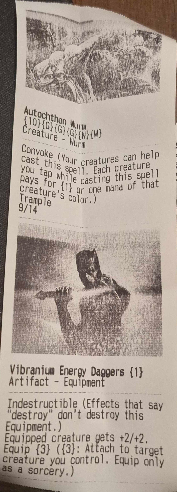

# MoJhoSto Basic Expanded Printer

MoJhoSto Basic Expanded Printer is a set of Python Scripts designed to run on a PC connected to an ECSPOS Receipt Printer.

## Table of Contents

- [About](#about)
- [MoJhoSto Expanded Rules](#mojhosto-expanded-rules)
- [In Practice](#in-practice)
- [Setup](#setup)
- [Installation](#installation)
- [User Input Guide](#user-input-guide)
- [Credits](#credits)
- [Disclaimer](#disclaimer)

## About

Hayden Moritz created a receipt printer iteration of Momir Basic [for Raspberry Pi](https://github.com/MoritzHayden/momir-basic-printer). I wanted to create an expanded version due to my personal love for the expanded MoJhoSto variation of the format. I felt like it could stand to be more accessible than with a Raspberry Pi.

I provided the possibility for Stonehewer to use auras and custom modes for "Jace" and "Tibalt" which allow for any type selection for either Momir or Jhoira style Vanguards. Partially vibe-coded, checked closely for functionality. Jhoira and Tibalt don't provide pictures because it would get unwieldy.

<div align="center">
  
</div>

## MoJhoSto Expanded Rules

Format:
- Number of Players: 2+
- Your deck consists of 60 assorted basic lands, typically more swamps and/or mountains than others.
- Otherwise, normal MtG outside of optional Life/Hand changes.

Modes (Vanguards):
- Momir (Optional: Life+4):
  {X}, Discard a card: Create a token copy of a random creature card of mana value X. Activate only as a sorcery and only once each turn.
- Stonehewer Giant (Optional: Life-5. Hand+1): 
   Whenever a creature you control enters, create a token that's a copy of a random Equipment card with mana value less than that creature's mana value. Attach that Equipment to that creature.
- Jhoira (Optional: Hand+1):
  {3}, Discard a card, Choose instant or sorcery: View three random distinct cards of the type chosen. You may cast a copy of one of them without paying its mana cost. You may choose sorcery only if activated as a sorcery.
- Jace (expanded Momir, Optional: Life+1): 
  {X}, Discard a card, Choose any number of card type(s): Create a token copy of a random card of one or more of the chosen type(s). Activate only as a sorcery (unless the only chosen type is instant) and only once each turn.
- Tibalt (expanded Jhoira, Optional: Hand-2):
  {3}, Discard a card, Choose any number of card type(s): View three random distinct cards of one or more of the chosen type(s). You may cast a copy of one of them without paying its mana cost. You may choose non-instant types only as a sorcery.

## In Practice

| Momir:                               | MoSto:                               | Jhoira:                                |
| ------------------------------------ | ------------------------------------ | -------------------------------------- |
|  |  |  |

| Jace:                              | Tibalt:                                |
| ---------------------------------- | -------------------------------------- |
|  |  |

## Setup

Hardware:
- PC
- [ECSPOS Receipt Printer](https://www.amazon.com/Serounder-Bluetooth-Connection-Supports-Operating/dp/B0DY7D3FYY/) (I used USB, but you can try using Bluetooth or Network connections. You can definitely find cheaper printer options. I paid about 16.50 USD for a very similar model.)

Software:
- Python
- [Zadig](https://zadig.akeo.ie) (to rewrite the WinUSB drivers on the printer)
- LibUSB (as needed)

## Installation

1. Clone this repository and naviggate to the project directory.

```shell
git clone https://github.com/nkzieve/mojhosto-basic-printer.git
cd mojhosto-basic-printer
```

2. Install requirements.

```shell
pip install -r requirements.txt
```

3. Setup your printer with WinUSB in [Zadig](https://zadig.akeo.ie). Make sure you find the exact device in Zadig. You can enable all devices, then check by unplugging it and plugging it back in.

4. You should be able to find the VID and PID of your device in your Device Manager.

5. Assuming all is well, run the program (you can find it in the src folder). Replace the vendor id and product id below with whatever matches up to your device. (0x#### is standard formatting.)

```shell
python momir.py --vendor-id 0x0483 --product-id 0x5743
```

6. Enjoy!

## User Input Guide

Main Menu:
  - 1: Momir
  - 2: MoSto
  - 3: Jhoira
  - 4: Jace
  - 5: Tibalt
  - x: View the text of any mode(s).
  - c: View the (optional) starting life total and hand size changes.
  - q: Quit.

Momir:
  - 0-13, 15-16: Pick a mana value.
  - m: Return to the main menu.
  - q: Quit.

MoSto:
  A prompt will check if you want to include Auras (and if so, if you want to not include Equipment).
  - m: Return to the main menu.
  - q: Quit.

  Then:
  - 0-13, 15-16: Pick a mana value.
  - m: Return to the main menu.
  - q: Quit.

Jhoira:
  - 1: Sorcery
  - 2: Instant
  - m: Return to the main menu.
  - q: Quit.

Jace/Tibalt:
  Any combination of the numbers can be selected, separated by commas.
  - 1: Artifact
  - 2: Battle
  - 3: Creature
  - 4: Enchantment
  - 5: Instant
  - 6: Land
  - 7: Planeswalker
  - 8: Sorcery
  - m: Return to the main menu.
  - q: Quit.

## Credits

- Thanks to Massimiliano Collela and "Chingali" for being the first people to introduce me to MoJhoSto, in physical form.
- Thanks to Hayden Moritz for the inspiration to make my own version. 
- Thanks to Adhwa binti Anuar for giving me the motivation to work on my projects. I miss playing games together.

## Disclaimer

Neither this project nor its contributors are associated with Hasbro, Wizards of the Coast, Scryfall, or _Magic The Gathering_ in any way whatsoever.

<div align="center"><p>Copyright &copy; 2026 Nicholas Zieve</p></div>
